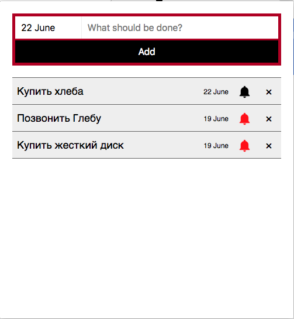

# React-Todo-List!

This chrome extension enables you organize your tasks effectively right from your browser.

### Install
- Clone this repo
- Navigate to chrome extension
- Make sure the  **Developer Mode**  box is checked
- Click on **Load unpacked extension**

### Is done
