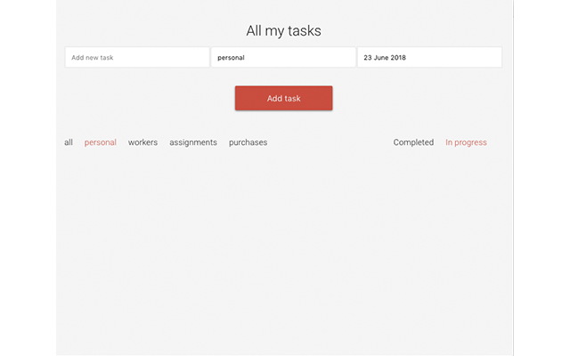
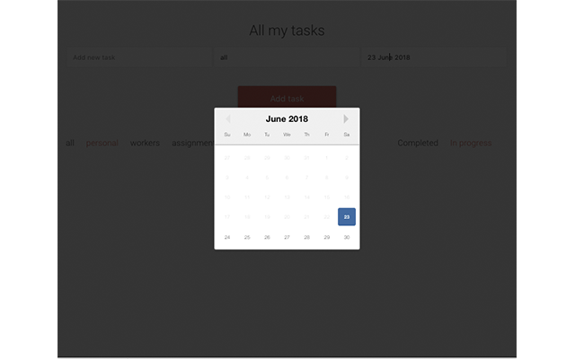
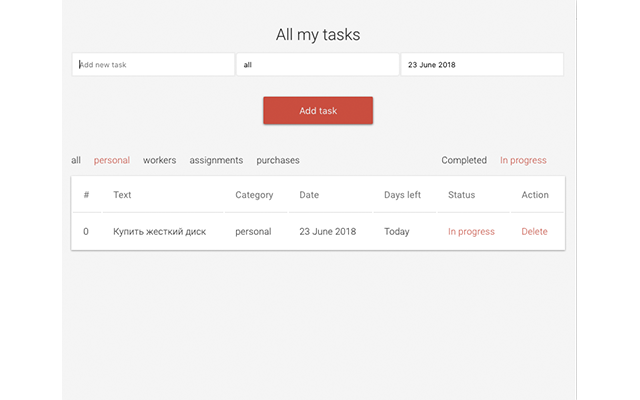
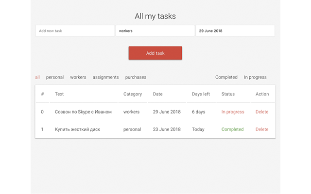

# React-Todo-List!

This chrome extension enables you organize your tasks effectively right from your browser.

### Install
- Clone this repo
- Navigate to chrome extension
- Make sure the  **Developer Mode**  box is checked
- Click on **Load unpacked extension**

[Link to Chrome Web Store](https://chrome.google.com/webstore/detail/the-to-do-list/pcefajagcblolfbmgoaiijfcemnkfbib)

### Что нужно добавить?
- Добавить нотификацию к заданием на текущей день
- Добавить нормальную проверку на текстовое поле
